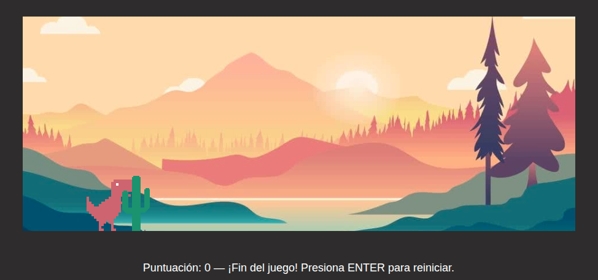
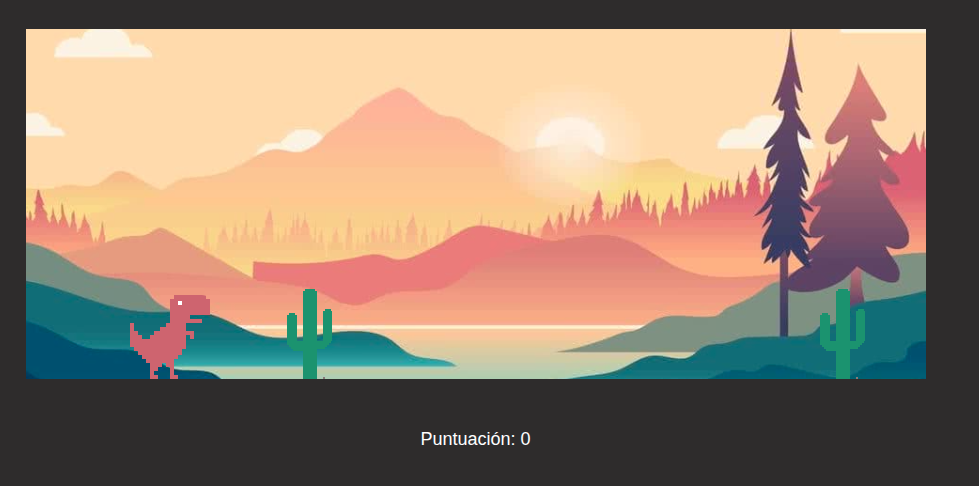

# Dinosaurio Saltarín 🦖


Juego web inspirado en el clásico juego del dinosaurio de Google Chrome sin conexión.  
El jugador controla un dinosaurio que debe esquivar obstáculos saltando mientras la velocidad aumenta progresivamente.

El proyecto incluye soporte para teclado y dispositivos móviles, sistema de puntuación y reinicio dinámico del juego.

---

# 🎮 Características Principales

- Sistema de salto fluido
- Obstáculos generados aleatoriamente
- Dificultad progresiva automática
- Sistema de puntuación en tiempo real
- Soporte para móviles mediante toque táctil
- Reinicio rápido sin recargar la página
- Colisiones detectadas dinámicamente
- Diseño visual inspirado en Dino Run

---

# 🚀 Demo Online

🔗 GitHub Pages:  
https://alonsocuevas.github.io/dino/

---

# 📂 Estructura del Proyecto

```bash
dino/
├── img/
├── index.html
├── README.md
├── script.js
└── styles.css
```

---

# 🎯 Funcionalidades

## 🎮 Controles

| Acción | Control |
|---|---|
| Saltar | `SPACE` o `↑` |
| Saltar en móvil | Toque en pantalla |
| Reiniciar juego | `ENTER` |

---

## 🦖 Mecánicas del Juego

- El dinosaurio puede saltar obstáculos tipo cactus
- Los obstáculos aparecen aleatoriamente
- La velocidad aumenta cada cierto tiempo
- El jugador obtiene puntos al esquivar obstáculos
- El juego finaliza al detectar una colisión
- El sistema permite reiniciar instantáneamente

---

# 🧠 Lógica del Juego

## Sistema de salto

El salto utiliza:

- gravedad
- velocidad vertical
- física básica de movimiento

```javascript
velocity += gravity;
jumpHeight += velocity;
```

---

## Dificultad progresiva

La velocidad de los obstáculos aumenta automáticamente:

```javascript
obstacleSpeed += 0.2;
```

Esto incrementa la dificultad conforme avanza la partida.

---

## Detección de colisiones

La colisión se calcula usando:

```javascript
getBoundingClientRect()
```

Comparando:

- posición del dinosaurio
- posición del obstáculo
- márgenes de seguridad

---

# 🛠️ Tecnologías Utilizadas

## Frontend
- HTML5
- CSS3
- JavaScript ES6

## Diseño
- Sprites personalizados
- Background dinámico
- Responsive interaction
- Control táctil para móviles

---

# 📦 Instalación y Uso

## 1️⃣ Clonar el repositorio

```bash
git clone https://github.com/alonsocuevas/dino.git
```

---

## 2️⃣ Entrar al proyecto

```bash
cd dino
```

---

## 3️⃣ Ejecutar el juego

Abrir:

```bash
index.html
```

en cualquier navegador moderno.

---

# 🎮 Cómo Jugar

1. Presiona `SPACE` o `↑` para saltar
2. Evita los cactus
3. Sobrevive el mayor tiempo posible
4. La velocidad aumentará progresivamente
5. Si pierdes, presiona `ENTER` para reiniciar

---

# 📱 Compatibilidad

| Plataforma | Compatible |
|---|---|
| Chrome | ✅ |
| Firefox | ✅ |
| Edge | ✅ |
| Opera | ✅ |
| Android | ✅ |
| iPhone | ✅ |

---

# 🎨 Diseño Visual

El proyecto utiliza:

- Fondo personalizado
- Sprites pixelados
- Diseño minimalista
- Escenario oscuro
- Sistema visual limpio y arcade



---

# 🔥 Características Técnicas

## Generación dinámica de obstáculos

```javascript
setTimeout(createObstacle, nextTime);
```

## Animación fluida con requestAnimationFrame

```javascript
requestAnimationFrame(update);
```

## Reinicio sin recargar página

```javascript
resetGame();
```

---

# 📈 Mejoras Futuras

- Sistema de récords con `localStorage`
- Sonidos y efectos
- Animaciones avanzadas
- Power-ups
- Múltiples escenarios
- Sistema de niveles
- Sprites animados del dinosaurio
- Compatibilidad fullscreen
- Menú principal
- Selector de dificultad

---

# 🧩 Recursos Utilizados

## Imágenes
- Dinosaurio sprite
- Cactus
- Fondo del escenario

## Mecánicas
- Física básica
- Detección de colisiones
- Movimiento dinámico

---

# 👨‍💻 Autor

## Alonso Cuevas Pizarro

### GitHub
https://github.com/alonsocuevas

### Portafolio
https://alonsocuevas.github.io/dev/

---

# 📄 Licencia

Este proyecto está bajo la licencia MIT.  
Puedes utilizarlo, modificarlo y distribuirlo libremente.

---

# ⭐ Objetivo del Proyecto

Este proyecto fue desarrollado para practicar:

- Manipulación del DOM
- Lógica de videojuegos en JavaScript
- Animaciones en tiempo real
- Física básica
- Detección de colisiones
- Eventos de teclado y táctiles
- Gestión dinámica de elementos HTML
- Desarrollo frontend interactivo